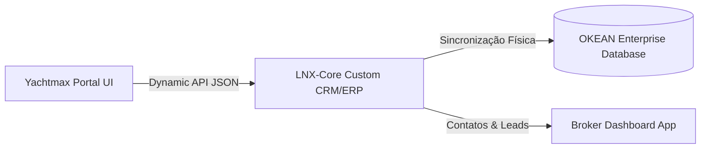

# SOFTWARE ENGINEERING INTELLIGENCE
## KNOWLEDGE CORE v2.0.0 | STATUS: ONLINE

> **Yachtmax Experience System™ — BoK Documentation Suite**
> Documento de Requisitos de Negócios (BRD).

---

# 02-brd.md — Documento de Requisitos de Negócios (BRD)

Este documento estabelece as diretrizes estratégicas e operacionais de negócio para o Yachtmax Experience System™, detalhando o papel institucional da OKEAN, a transição tecnológica para o LNX-Core e os objetivos de conversão e monetização.

## 1. Contexto Institucional e Investimento OKEAN

A OKEAN Estaleiro atua como a investidora e provedora de infraestrutura principal da Yachtmax. 

### Pilares de Apoio Institucional:
*   **Capital de Desenvolvimento:** Financiamento direto da plataforma Yachtmax Experience System™ para modernizar a imagem de marca do grupo de forma digital-first.
*   **Infraestrutura e Ferramental:** Sincronização direta com a capacidade industrial e informações técnicas de fabricação das embarcações, reduzindo o tempo de criação de modelos 3D a partir de dados CAD industriais.
*   **OKEAN DNA:** Embora a Yachtmax mantenha sua marca e DNA focados em brokerage multimarcas e seminovos de alto luxo, a solidez financeira e institucional da OKEAN atua nos bastidores como um selo de confiança e autoridade para compradores e brokers.

---

## 2. A Transição Tecnológica: Substituição do HubSpot pelo LNX-Core

Em um movimento estratégico liderado pelo co-fundador da **Linx** (que é o maior investidor individual da OKEAN), o grupo OKEAN e a Yachtmax abandonaram o HubSpot CRM. Toda a operação passa a ser centralizada no **LNX-Core Custom CRM/ERP**, uma plataforma de alta performance desenvolvida especificamente para o segmento corporativo de luxo marítimo.

### Justificativa da Mudança para LNX-Core:
1.  **Segurança e Privacidade Absoluta:** O HubSpot, como SaaS em nuvem pública compartilhada, não oferecia o nível de isolamento de banco de dados e controle de Row-Level Security exigido para transações sigilosas de UHNWIs (Pocket Listings / Off-Market).
2.  **Arquitetura Enterprise Customizada:** O LNX-Core permite indexação nativa de metadados complexos de embarcações, tabelas de comissionamento de brokers multimarcas, fluxos de importação/exportação aduaneira de iates e integração direta com o ERP industrial da OKEAN.
3.  **Tecnologia de Ponta Linx:** O sistema utiliza padrões modernos de barramento de dados e alta performance criados por pioneiros do mercado de ERPs do Brasil, garantindo latência quase nula na sincronização de dados e gerenciamento de inventário em tempo real.

---

## 3. Requisitos de Negócio e Metas Estratégicas

### BR-01: Atração baseada na Autoridade do Broker (Broker Branding)
A plataforma deve atuar como uma vitrine de atração orgânica para os brokers. Cada broker da Yachtmax deve possuir um perfil digital sofisticado e customizado, servindo de autoridade individual.
*   *Mecanismo:* Broker Cards ricos, contendo embarcações favoritas, idiomas, áreas de navegação e atalhos rápidos para o WhatsApp pessoal integrados à API do LNX-Core.

### BR-02: Inventário Confidencial (Pocket Listings / Off-Market)
Permitir que embarcações exclusivas sejam visualizadas apenas por clientes altamente qualificados sob convite direto dos brokers, protegendo a privacidade de venda.
*   *Mecanismo:* Acesso restrito via autenticação criptografada por token, onde a listagem e mídias do iate são criptografadas e não indexadas por buscadores públicos (Google/Bing).

### BR-03: Monetização e Conversão Indireta
A principal meta da plataforma não é a transação online direta, mas a **redução de fricção no agendamento de testes de mar e cafés presenciais**.
*   *Mecanismo:* CTAs que convidam para a experiência (ex: "Solicitar Visita Privada a Bordo", "Agendar Café na Marina") em vez de CTAs de compra clássicos. Todo clique e interação na interface do iate é enviado como evento de score de intenção (Desire Score™) para o LNX-Core CRM.

---
→ ALIGN  →  INTEGRATE  →  OPTIMIZE  →  INNOVATE  →  TRANSFORM  →  DELIVER VALUE

**SYSTEM STATUS: ALL SYSTEMS OPERATIONAL**
